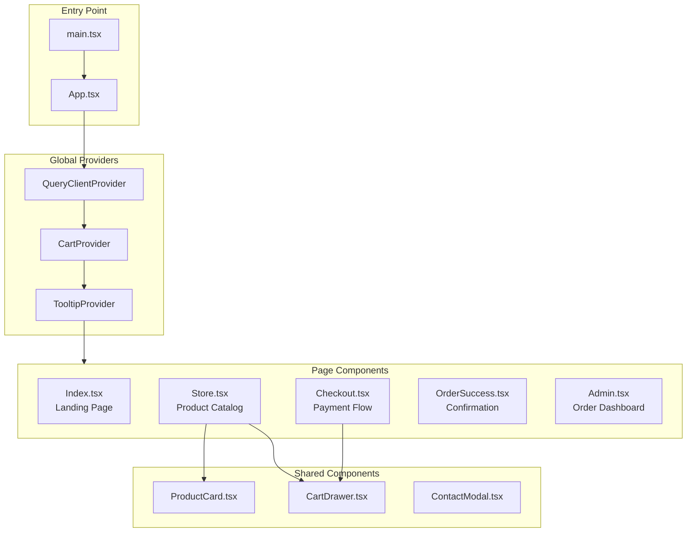
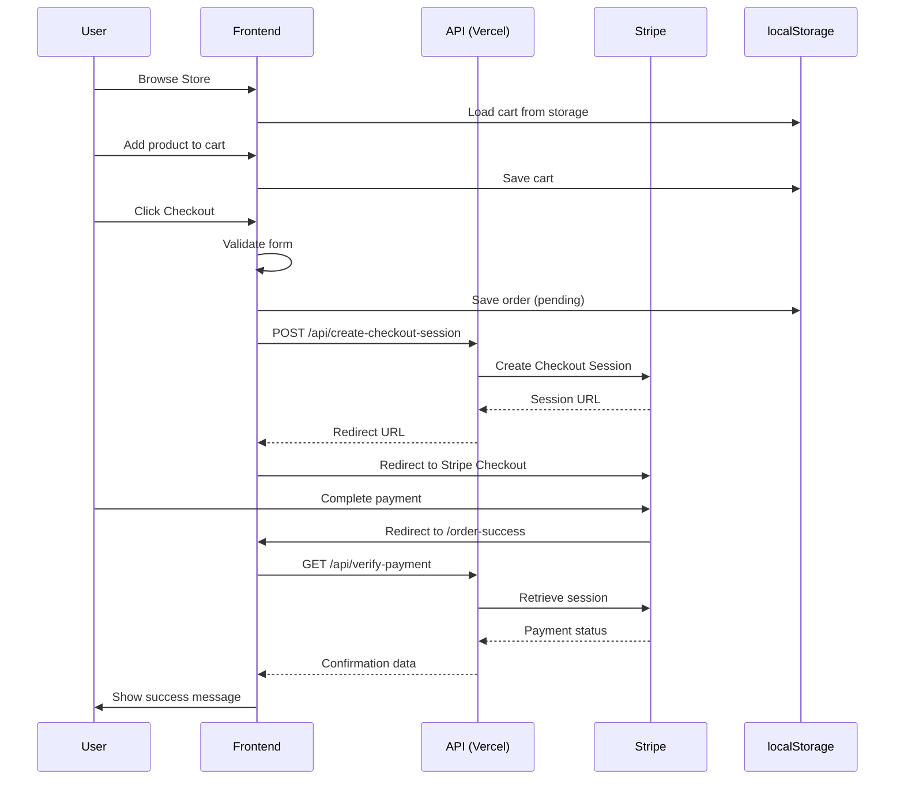
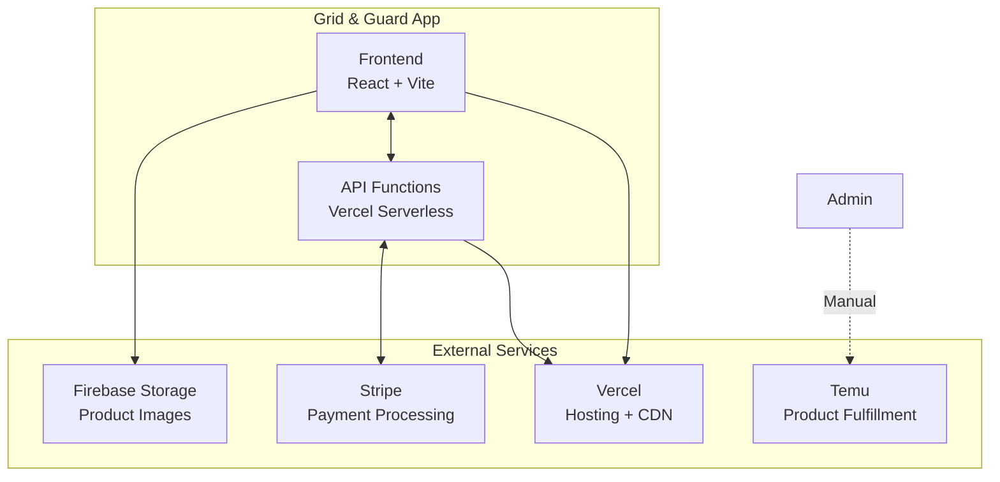
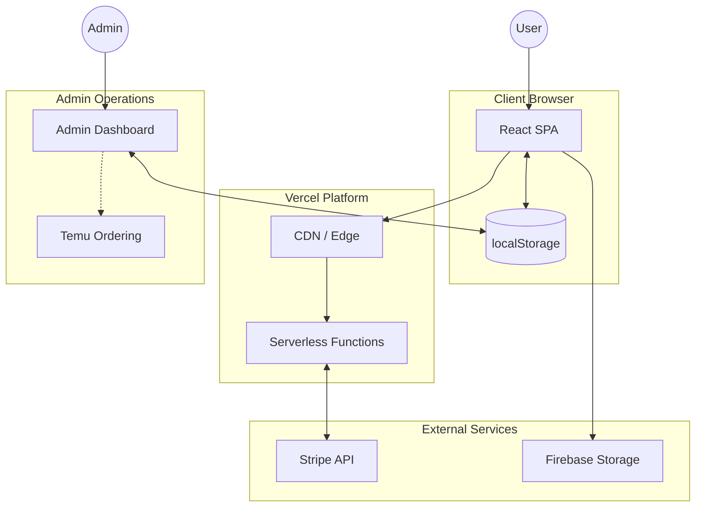

# Grid & Guard - Application Architecture Documentation


---

## 📋 Project Summary

**Grid & Guard** is a premium e-commerce web application specializing in iPhone cases and screen protectors. The platform provides a modern, mobile-first shopping experience with features including:

- **Product Catalog**: 8 case designs with multiple color variants across 20 iPhone models
- **Screen Protector Bundles**: 3 protector options bundled with each case purchase
- **Shopping Cart**: Persistent cart with quantity management
- **Stripe Checkout**: Secure payment processing via Stripe Checkout
- **Admin Dashboard**: Password-protected order management with Temu fulfillment integration
- **Grand Opening Landing Page**: Email/phone capture for marketing

### Business Model
The application operates as a dropshipping storefront where:
1. Customers purchase products through the Grid & Guard website
2. Payments are processed via Stripe
3. Admin fulfills orders by ordering from Temu suppliers
4. Products ship directly to customers

---

## 🗂️ Folder / File Structure

```
Grid-Guard/
├── 📁 api/                          # Vercel Serverless Functions
│   ├── create-checkout-session.js  # Stripe checkout session creation
│   └── verify-payment.js           # Payment verification endpoint
│
├── 📁 public/                       # Static assets
│   └── (favicon, images)
│
├── 📁 src/                          # Main application source
│   ├── 📁 components/               # React components
│   │   ├── 📁 ui/                   # shadcn/ui component library (49 components)
│   │   ├── CartDrawer.tsx          # Sliding cart panel
│   │   ├── ContactModal.tsx        # Customer support modal
│   │   ├── NavLink.tsx             # Navigation link component
│   │   ├── PasswordModal.tsx       # Admin password entry
│   │   └── ProductCard.tsx         # Product display card
│   │
│   ├── 📁 context/                  # React Context providers
│   │   └── CartContext.tsx         # Global cart state management
│   │
│   ├── 📁 data/                     # Static data definitions
│   │   └── products.ts             # Product catalog (cases, models, protectors)
│   │
│   ├── 📁 hooks/                    # Custom React hooks
│   │   ├── use-mobile.tsx          # Mobile device detection
│   │   └── use-toast.ts            # Toast notification hook
│   │
│   ├── 📁 lib/                      # Utilities and configurations
│   │   ├── constants.ts            # Centralized constants
│   │   ├── firebase.ts             # Firebase initialization
│   │   └── utils.ts                # Utility functions (cn, etc.)
│   │
│   ├── 📁 pages/                    # Route page components
│   │   ├── Admin.tsx               # Order management dashboard
│   │   ├── Checkout.tsx            # Checkout form & payment
│   │   ├── Index.tsx               # Landing page (grand opening)
│   │   ├── NotFound.tsx            # 404 page
│   │   ├── OrderSuccess.tsx        # Post-payment confirmation
│   │   ├── Privacy.tsx             # Privacy policy
│   │   ├── Returns.tsx             # Returns policy
│   │   ├── Store.tsx               # Product catalog
│   │   └── Terms.tsx               # Terms of service
│   │
│   ├── 📁 types/                    # TypeScript type definitions
│   │   └── store.ts                # Store-related interfaces
│   │
│   ├── App.tsx                      # Root component with routing
│   ├── index.css                    # Global styles & Tailwind config
│   ├── main.tsx                     # Application entry point
│   └── vite-env.d.ts               # Vite type declarations
│
├── .env                             # Environment variables (gitignored)
├── .env.example                     # Environment template
├── index.html                       # HTML entry point
├── package.json                     # Dependencies & scripts
├── server.js                        # Local development Express server
├── tailwind.config.ts              # Tailwind CSS configuration
├── tsconfig.json                    # TypeScript configuration
├── vercel.json                      # Vercel deployment config
└── vite.config.ts                   # Vite build configuration
```

---

## 🧩 Module / Component Map

### Core Application Components



### Component Responsibilities

| Component | Responsibility | Key Dependencies |
|-----------|---------------|------------------|
| **App.tsx** | Root component, routing setup, provider hierarchy | react-router-dom, tanstack/react-query |
| **CartContext.tsx** | Global cart state, persistence, calculations | localStorage, products.ts |
| **Index.tsx** | Landing page with email/phone capture flow | React state, localStorage |
| **Store.tsx** | Product grid, filtering, cart integration | CartContext, products.ts |
| **ProductCard.tsx** | Individual product display with variant selection | CartContext |
| **CartDrawer.tsx** | Slide-out cart panel with item management | CartContext |
| **Checkout.tsx** | Customer info form, Stripe redirect | CartContext, Stripe API |
| **OrderSuccess.tsx** | Payment confirmation, order details | Stripe API (verify) |
| **Admin.tsx** | Order list, status management, Temu links | localStorage |

---

## 🔄 Data Flow / Workflow

### Customer Purchase Flow



### State Management Flow

```mermaid
flowchart LR
    subgraph CartContext
        State[items: CartItem[]]
        Actions[addToCart<br/>removeFromCart<br/>updateQuantity<br/>clearCart]
        Derived[getSubtotal<br/>getShipping<br/>getTotal<br/>itemCount]
    end
    
    subgraph Persistence
        LS[(localStorage)]
    end
    
    subgraph Components
        Store[Store Page]
        Cart[Cart Drawer]
        Checkout[Checkout Page]
    end
    
    Components --> Actions
    Actions --> State
    State --> Derived
    State <--> LS
    Derived --> Components
```

---

## 📦 Dependencies & External Services

### Frontend Dependencies

| Package | Version | Purpose |
|---------|---------|---------|
| **react** | 18.3.1 | UI framework |
| **react-router-dom** | 6.30.1 | Client-side routing |
| **@tanstack/react-query** | 5.83.0 | Server state management |
| **tailwindcss** | 3.4.17 | Utility-first CSS |
| **@radix-ui/*** | Various | Accessible UI primitives |
| **lucide-react** | 0.462.0 | Icon library |
| **zod** | 3.25.76 | Schema validation |
| **react-hook-form** | 7.61.1 | Form management |
| **recharts** | 2.15.4 | Charts (admin analytics) |
| **sonner** | 1.7.4 | Toast notifications |

### Backend/Server Dependencies

| Package | Version | Purpose |
|---------|---------|---------|
| **express** | 5.2.1 | Local dev server |
| **stripe** | 20.0.0 | Payment processing |
| **cors** | 2.8.5 | CORS middleware |
| **dotenv** | 17.2.3 | Environment variables |

### External Services



| Service | Purpose | Integration |
|---------|---------|-------------|
| **Stripe** | Payment processing | API integration via `stripe` SDK |
| **Firebase Storage** | Product image hosting | Direct URL references |
| **Vercel** | Hosting, serverless functions, CDN | Deployment platform |
| **Temu** | Product fulfillment (dropshipping) | Manual via Admin dashboard links |

---

## ✨ Feature List

### Public Features

| Feature | Route | Description |
|---------|-------|-------------|
| **Landing Page** | `/` | Grand opening signup with phone/email capture |
| **Product Catalog** | `/store` | Browse 8 case designs × multiple colors × 20 models |
| **Shopping Cart** | Drawer | Add/remove items, change quantities, select protectors |
| **Checkout** | `/checkout` | Customer info form → Stripe payment |
| **Order Confirmation** | `/order-success` | Payment verification, order summary |
| **Privacy Policy** | `/privacy` | Legal privacy information |
| **Terms of Service** | `/terms` | Legal terms |
| **Returns Policy** | `/returns` | Return/refund information |

### Admin Features

| Feature | Route | Description |
|---------|-------|-------------|
| **Order Dashboard** | `/admin` | View all orders, sorted by date |
| **Status Management** | `/admin` | Update order status (pending → paid → shipped → delivered) |
| **Temu Integration** | `/admin` | Quick links to order products from Temu |
| **Order Details** | `/admin` | Customer info, items, shipping address, totals |

### API Endpoints

| Endpoint | Method | Purpose |
|----------|--------|---------|
| `/api/create-checkout-session` | POST | Create Stripe Checkout session |
| `/api/verify-payment` | GET | Verify payment status by session ID |
| `/api/health` | GET | Health check (local dev only) |

---

## 🏗️ Architecture / Design Patterns

### Overall Architecture

```
┌─────────────────────────────────────────────────────────────────┐
│                        Presentation Layer                        │
│  ┌─────────────┐  ┌─────────────┐  ┌─────────────┐              │
│  │   Pages     │  │ Components  │  │    UI       │              │
│  │  (Routes)   │  │  (Shared)   │  │ (shadcn)    │              │
│  └─────────────┘  └─────────────┘  └─────────────┘              │
└─────────────────────────────────────────────────────────────────┘
                              │
                              ▼
┌─────────────────────────────────────────────────────────────────┐
│                        State Layer                               │
│  ┌─────────────────────┐  ┌─────────────────────┐               │
│  │   CartContext       │  │   localStorage      │               │
│  │   (React Context)   │  │   (Persistence)     │               │
│  └─────────────────────┘  └─────────────────────┘               │
└─────────────────────────────────────────────────────────────────┘
                              │
                              ▼
┌─────────────────────────────────────────────────────────────────┐
│                        Data Layer                                │
│  ┌─────────────────────┐  ┌─────────────────────┐               │
│  │   Static Data       │  │   API Calls         │               │
│  │   (products.ts)     │  │   (Stripe)          │               │
│  └─────────────────────┘  └─────────────────────┘               │
└─────────────────────────────────────────────────────────────────┘
                              │
                              ▼
┌─────────────────────────────────────────────────────────────────┐
│                        API Layer                                 │
│  ┌─────────────────────┐  ┌─────────────────────┐               │
│  │   Vercel Functions  │  │   Express Server    │               │
│  │   (Production)      │  │   (Development)     │               │
│  └─────────────────────┘  └─────────────────────┘               │
└─────────────────────────────────────────────────────────────────┘
```

### Design Patterns Used

| Pattern | Implementation | Location |
|---------|---------------|----------|
| **Provider Pattern** | React Context for global state | `CartContext.tsx` |
| **Compound Components** | shadcn/ui components | `components/ui/*` |
| **Container/Presenter** | Pages as containers, components as presenters | `pages/` vs `components/` |
| **Singleton** | Single cart state, single query client | `App.tsx` |
| **Factory** | Product variant generation | `products.ts` |
| **Strategy** | Different screen protector pricing | `products.ts` |

### Key Design Decisions

1. **Static Product Data**: Products defined in TypeScript for type safety and simplicity
2. **Client-Side Persistence**: Cart stored in localStorage for session persistence
3. **Serverless Backend**: Vercel functions for Stripe integration (no dedicated server)
4. **Component Library**: shadcn/ui for consistent, accessible UI components
5. **Single Page Application**: React Router for client-side navigation

---

## ⚠️ Potential Weaknesses / Risks

### Critical

| Issue | Risk Level | Description | Mitigation |
|-------|------------|-------------|------------|
| **localStorage Orders** | 🔴 High | Orders only stored in browser, lost if cleared | Implement Firebase Firestore |
| **Simple Admin Auth** | 🔴 High | Password-only protection for admin | Implement Firebase Auth |

### Moderate

| Issue | Risk Level | Description | Mitigation |
|-------|------------|-------------|------------|
| **No Tests** | 🟠 Medium | Zero test coverage | Add Jest/Vitest tests |
| **Bundle Size** | 🟠 Medium | 49 UI components, many unused | Tree-shake or remove unused |
| **No Error Boundaries** | 🟠 Medium | Component errors crash entire app | Add React Error Boundaries |
| **Image Loading** | 🟠 Medium | No lazy loading or skeletons | Add loading states |

### Low Priority

| Issue | Risk Level | Description | Mitigation |
|-------|------------|-------------|------------|
| **No Form Validation** | 🟡 Low | Basic HTML5 validation only | Use Zod schemas |
| **Hardcoded Pricing** | 🟡 Low | Prices in static file | Move to CMS/database |
| **No Analytics** | 🟡 Low | No tracking of user behavior | Add Google Analytics |

---

## 📊 Diagram: Complete System Architecture



---

## 🚀 How to Navigate / Contribute

### Getting Started

```bash
# 1. Clone the repository
git clone <repository-url>
cd Grid-Guard

# 2. Install dependencies
npm install

# 3. Set up environment variables
cp .env.example .env
# Edit .env with your Firebase and Stripe credentials

# 4. Start development server
npm run dev        # Frontend (port 8080)
npm run server     # Backend (port 3001) - in another terminal
```

### Key Files to Understand First

1. **`src/App.tsx`** - Application structure and routing
2. **`src/context/CartContext.tsx`** - How cart state works
3. **`src/data/products.ts`** - Product catalog structure
4. **`src/pages/Store.tsx`** - Main shopping experience
5. **`api/create-checkout-session.js`** - Payment flow

### Adding a New Feature

1. **New Page**: Create in `src/pages/`, add route in `App.tsx`
2. **New Component**: Create in `src/components/`, import with `@/components/`
3. **New API Endpoint**: Create in `api/`, follows Vercel serverless format
4. **New Type**: Add to `src/types/store.ts`
5. **New Constant**: Add to `src/lib/constants.ts`

### Code Style

- **Components**: Functional components with hooks
- **Styling**: Tailwind CSS utility classes
- **State**: React Context for global, useState for local
- **Types**: TypeScript interfaces in `types/` directory
- **Imports**: Use `@/` alias for `src/` directory

---

## 📝 Metadata & Maintenance Notes

### Version History

| Version | Date | Changes |
|---------|------|---------|
| 1.0.0 | 2024-12 | Initial release with security fixes |
| 0.0.0 | 2024-xx | Initial development (Lovable generated) |

### Scripts

```bash
npm run dev         # Start Vite dev server
npm run server      # Start local Express server for Stripe
npm run build       # Production build
npm run preview     # Preview production build
npm run lint        # Run ESLint
```

### Environment Variables

| Variable | Required | Description |
|----------|----------|-------------|
| `VITE_FIREBASE_API_KEY` | ✅ | Firebase API key |
| `VITE_FIREBASE_AUTH_DOMAIN` | ✅ | Firebase auth domain |
| `VITE_FIREBASE_PROJECT_ID` | ✅ | Firebase project ID |
| `VITE_FIREBASE_STORAGE_BUCKET` | ✅ | Firebase storage bucket |
| `VITE_FIREBASE_MESSAGING_SENDER_ID` | ✅ | Firebase messaging ID |
| `VITE_FIREBASE_APP_ID` | ✅ | Firebase app ID |
| `STRIPE_SECRET_KEY` | ✅ | Stripe secret key (server-side) |
| `VITE_ADMIN_PASSWORD` | ⚠️ | Admin panel password |

### Deployment Checklist

- [ ] Set all environment variables in Vercel
- [ ] Configure custom domain
- [ ] Set up Stripe webhook (optional, for order sync)
- [ ] Configure Firebase security rules
- [ ] Test checkout flow end-to-end
- [ ] Verify CORS origins match production domain

---

## 📚 Additional Resources

- [React Documentation](https://react.dev/)
- [Vite Documentation](https://vitejs.dev/)
- [Tailwind CSS Documentation](https://tailwindcss.com/docs)
- [shadcn/ui Components](https://ui.shadcn.com/)
- [Stripe Checkout Documentation](https://stripe.com/docs/payments/checkout)
- [Vercel Serverless Functions](https://vercel.com/docs/functions)
- [Firebase Storage](https://firebase.google.com/docs/storage)

---

*Generated on 2024-12-08 | Grid & Guard v1.0.0*
